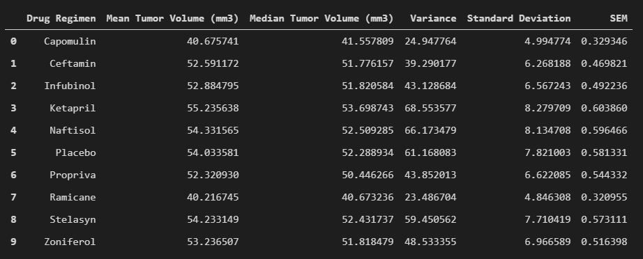
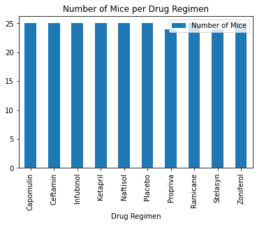
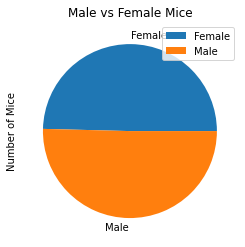
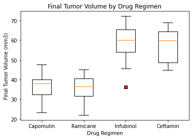
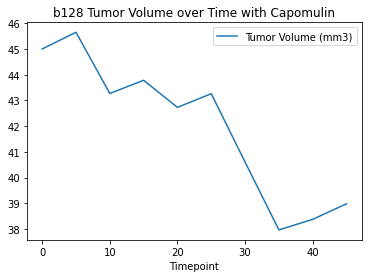
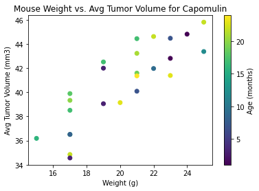
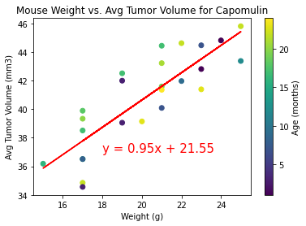

# Matplotlib-Challenge

## Background

The goal of this challenge was to analyze a recent animal study using Python and Matplotlib.  In this study, 249 mice identified with tumor growth were treated with a variety of drug regimens.

## Observations

* A strong positive relationship exists between mouse weight and tumor volume. The correlation between mouse weight and tumor volume is 0.84
* Capomulin effectively shrunk the tumor over time.
* There was an equal distribution of Male and Female mice in the study.
* Each drug regimen had an equal number of mice in the trial.

## Analysis

#### Read, Import, and Merge Datasets

	# Dependencies and Setup
	import matplotlib.pyplot as plt
	import pandas as pd
	import scipy.stats as st
	import numpy as np
	from scipy.stats import linregress

	# Study data files
	mouse_metadata_path = "data/Mouse_metadata.csv"
	study_results_path = "data/Study_results.csv"

	# Read the mouse data and the study results
	mouse_metadata = pd.read_csv(mouse_metadata_path)
	study_results = pd.read_csv(study_results_path)

	# Combine the data into a single dataset
	data=pd.merge(mouse_metadata, study_results, on="Mouse ID", how = "outer")
	data=data.sort_values(['Mouse ID', 'Timepoint'])

	# Display the data table for preview
	data.head()

#### Clean the data and remove duplicates

	# Getting the duplicate mice by ID number that shows up for Mouse ID and Timepoint. 
	duplicate= data[['Mouse ID','Timepoint']].duplicated()
	duplicate_mouse = data[duplicate]['Mouse ID'].unique()

	# Create a clean DataFrame by dropping the duplicate mouse by its ID.
	index=data[data['Mouse ID'] == duplicate_mouse[0]].index
	clean_df=data.drop(index)
	clean_df.head()

#### Summary Statistics

Generate a summary statistics table consisting of the mean, median, variance, standard deviation, and SEM of the tumor volume for each drug regimen.

#### Bar and Pie Charts

* Generate a bar plot using both Pandas's `DataFrame.plot()` and Matplotlib's `pyplot` that shows  the number of total mice for each treatment regimen throughout the course of the study.

* Generate a pie plot using both Pandas's `DataFrame.plot()` and Matplotlib's `pyplot` that shows the distribution of female or male mice in the study.

#### Quartiles, Outliers and Boxplots

* Calculate the final tumor volume of each mouse across four of the most promising treatment regimens: Capomulin, Ramicane, Infubinol, and Ceftamin. 
* Calculate the quartiles and IQR and quantitatively determine if there are any potential outliers across all four treatment regimens.

	  # Put treatments into a list for for loop (and later for plot labels)
	  treatments = ["Capomulin", "Ramicane", "Infubinol", "Ceftamin"]

	  # Create empty list to fill with tumor vol data (for plotting)
	  tumor_vol = []

	  # Calculate the IQR and quantitatively determine if there are any potential outliers. 

	  outliers=[]    
    	  # Locate the rows which contain mice on each drug and get the tumor volumes
	  for treatment in treatments:
    		mouseid=mouse_data.loc[(mouse_data["Drug Regimen"]==treatment) & (mouse_data['Timepoint']==mouse_data['Max Time'])]
    		mouseid=mouseid.set_index('Drug Regimen')
    		tumor_vol.append(mouseid['Tumor Volume (mm3)'])
    		# Determine outliers using upper and lower bounds
    		quartiles = mouseid['Tumor Volume (mm3)'].quantile([.25,.5,.75])
    		lowerq = quartiles[0.25]
    		upperq = quartiles[0.75]
    		iqr = upperq-lowerq
    		lower_bound = lowerq - (1.5*iqr)
    		upper_bound = upperq + (1.5*iqr)
    		check_outliers=(mouseid.loc[(mouseid['Tumor Volume (mm3)']>upper_bound)|(mouseid['Tumor Volume (mm3)']<lower_bound)])
    		outliers=check_outliers["Mouse ID"].unique()
    		

* Generate a box and whisker plot of the final tumor volume for all four treatment regimens and highlight any potential outliers in the plot by changing their color and style.

#### Line and Scatter Plots

* Plot the tumor volume over time for a mouse treated with Capomulin.

* Generate a scatter plot of mouse weight vs average tumor volume.

#### Correlation and Regression

* Calculate the correlation coefficient and linear regression model between mouse weight and average tumor volume for the Capomulin treatment. Plot the linear regression model on top of the previous scatter plot.

	  # Calculate the correlation coefficient and linear regression model 
	  # for mouse weight and average tumor volume for the Capomulin regimen
	  (slope, intercept, rvalue, pvalue, stderr) = st.linregress(Avg_Mouse_Weight, Avg_Tumor_Vol)
	  regress_values = Avg_Mouse_Weight * slope + intercept
	  line_eq = "y = " + str(round(slope,2)) + "x + " + str(round(intercept,2))
	  correlation=st.pearsonr(Avg_Mouse_Weight, Avg_Tumor_Vol)
	  print(f"The correlation between mouse weight and tumor volume is {round(correlation[0],2)}")
	  print(f"The final r-squared value is {round((rvalue**2),2)}")
	  plt.scatter(Avg_Mouse_Weight, Avg_Tumor_Vol, c=Age)
	  clb=plt.colorbar()
	  plt.title("Mouse Weight vs. Avg Tumor Volume for Capomulin")
	  plt.xlabel("Weight (g)")
	  plt.ylabel("Avg Tumor Volume (mm3)")
	  clb.set_label("Age (months)")
	  plt.plot(Avg_Mouse_Weight, regress_values, '-r')
	  plt.annotate(line_eq,(18,37),fontsize=15,color="red")

